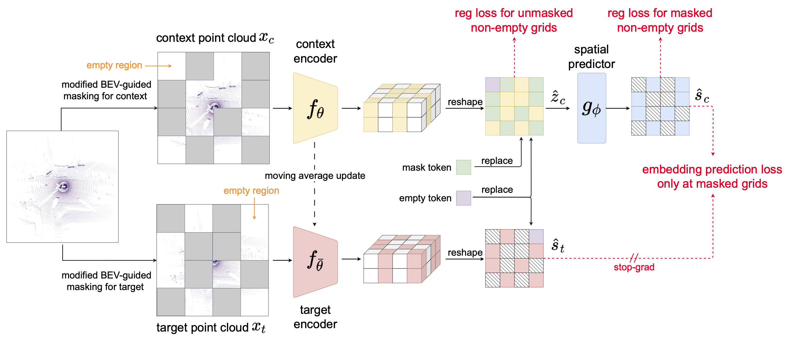

# [AAAI 2026] AD-L-JEPA: Self-Supervised Representation Learning with Joint Embedding Predictive Architecture for Automotive LiDAR Object Detection

Official source code repo for AD-L-JEPA: Self-Supervised Representation Learning with Joint Embedding Predictive Architecture for Automotive LiDAR Object Detection (https://arxiv.org/abs/2501.04969), the first joint-embedding predictive architecture (JEPA) based method for self-supervised representation learning of autonomous driving scenarios with LiDAR data.




Timelines:
- [x] Initial commit
- [x] Source code release by the end of January 2025
- [x] Make code more organized and release pretrained models by Nov 17th, 2025. 


If this paper is helpful for you, you may consider cite it via:
```bibtex
@misc{zhu2025adljepa,
      title={Self-Supervised Representation Learning with Joint Embedding Predictive Architecture for Automotive LiDAR Object Detection}, 
      author={Haoran Zhu and Zhenyuan Dong and Kristi Topollai and Beiyao Sha and Anna Choromanska},
      year={2025},
      eprint={2501.04969},
      archivePrefix={arXiv},
      primaryClass={cs.RO},
      url={https://arxiv.org/abs/2501.04969}, 
}
```


## Pre-trained Models, Tensorboard Logs
AD-L-JEPA self-supervised pre-trained models:
|       Dataset      |                           Weights & Tensorboard Logs                           |
| :---------------: | :----------------------------------------------------------: |
| KITTI3D  | [Google_drive](https://drive.google.com/drive/folders/1RbOyBm15gRLBsgFSIrPxSshC1daOob3n?usp=sharing) |

## Installation

This repo is developed by Python 3.8.

Installing pytorch:
```
pip install torch==1.10.1+cu111 torchvision==0.11.2+cu111 torchaudio==0.10.1 -f https://download.pytorch.org/whl/cu111/torch_stable.html
```

Installing other packages
```
pip install -r requirements.txt
```

For other installation requirements:
Please refer to [INSTALL.md](docs/INSTALL.md) for the installation of [OpenPCDet(v0.5)](https://github.com/open-mmlab/OpenPCDet).

## Setting up dataset

Please refer to [GETTING_STARTED.md](docs/GETTING_STARTED.md) .

Set up KITTI dataset with different label efficiency, e.g, :
```
python -m pcdet.datasets.kitti.kitti_dataset_label_efficiency create_kitti_infos_label_efficiency tools/cfgs/dataset_configs/kitti_dataset_20_percent.yaml 
```


## Usage

##### Pre-training


```
Train with multiple GPUs:
bash ./scripts/dist_pretrain.sh ${NUM_GPUS}  --cfg_file ${CFG} --extra_tag ${EXP_TAG}

Train with a single GPU:
python3 ssl_pretrain.py  --cfg_file ${CFG} --extra_tag ${EXP_TAG}
```
e.g.:
```
bash ./scripts/dist_pretrain.sh 4 --cfg_file cfgs/kitti_models/ad_l_jepa_kitti.yaml --extra_tag ${EXP_TAG}
```

##### Then fine-tuning model

Same as [OpenPCDet](https://github.com/open-mmlab/OpenPCDet), e.g.:

```
bash ./scripts/dist_train.sh ${NUM_GPUS}  --cfg_file cfgs/kitti_models/second.yaml  --pretrained_model ../output/kitti/voxel_mae/ckpt/check_point_10.pth --extra_tag ${EXP_TAG}$
```

## Acknowledgement

This repository is based on [OpenPCDet](https://github.com/open-mmlab/OpenPCDet), [Occupancy-MAE](https://github.com/chaytonmin/Occupancy-MAE), [BEV-MAE](https://github.com/VDIGPKU/BEV-MAE), [DINO](https://github.com/facebookresearch/dino)

